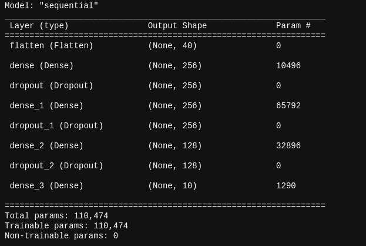

# Sami

## Instruciones de funcionamiento

#### para poder utilizar el Sistema sami, se ha agregado el siguiente apartado.

#### primeramente se establece el entrenamiento del mismo.

##### Se importan las bibliotecas necesarias para poder correr el codigo

```python
import numpy as np
import IPython
import keras
import librosa
import whisper
from nltk.sentiment import SentimentIntensityAnalyzer
from translate import Translator
import openai as analizer
```

##### Se procede con el proceso de declaracion de funciones y de variables para el funcionamiento del sistema.

```python
translator= Translator(from_lang="es",to_lang="en")

modelo = whisper.load_model("medium")

class Predictions:

    def __init__(self, path, file):
        self.path = path
        self.file = file
    def cargar_modelo(self):
        self.cargar_modelo = keras.models.load_model(self.path)
        return self.cargar_modelo.summary()
    def predicciones(self):
        data, sampling_rate = librosa.load(self.file)
        mfccs = np.mean(librosa.feature.mfcc(y=data, sr=sampling_rate, n_mfcc=40).T, axis=0)
        x = np.expand_dims(mfccs, axis=1)
        x = np.expand_dims(x, axis=0)
        predictions = np.argmax(self.cargar_modelo.predict(x),axis=-1)
        print("Emocion identificada:", self.convertclasstoemotion(predictions))    
    @staticmethod
    def convertclasstoemotion(pred):

        label_conversion = {'0': 'triste',
                            '1': 'feliz',
                            '2': 'neutral',
                         }
        for key, value in label_conversion.items():
            if int(key) == pred:
                label = value
                global emotion
                emotion=value
        return label

pred = Predictions(path='trainedModel/emotion.h5',file='noeneutral.wav')
pred2= Predictions(path='trainedModel/emotion.h5',file='noefeliz.wav')
pred3= Predictions(path='trainedModel/emotion.h5',file='maria2.wav')
```

##### Podemos escuchar el audio de prueba con el que estuvimos trabajando

<audio controls="controls">
 <source type="audio/mp3" src="Media/cancion.mp3"></source>
 </audio>

##### Aqui podremos visualizar los datos con los que el modelo fue entrenado


